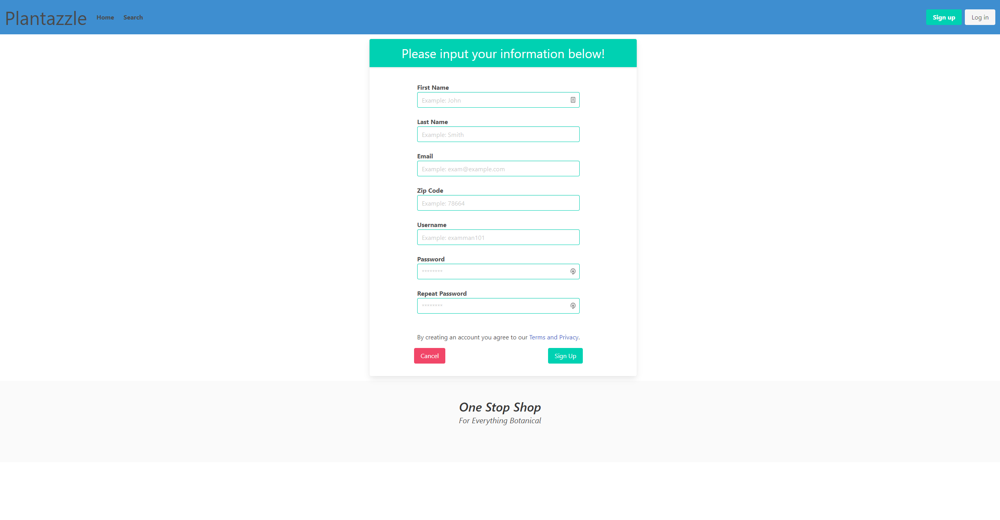
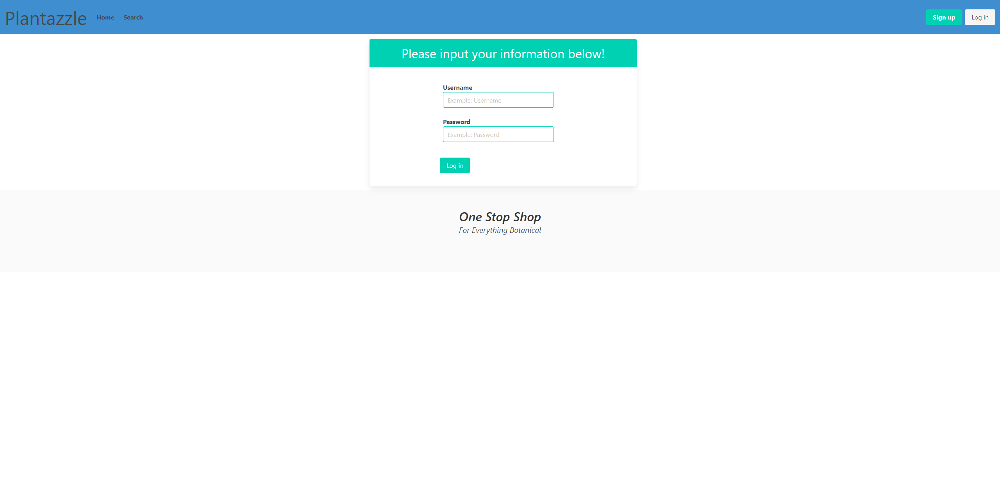
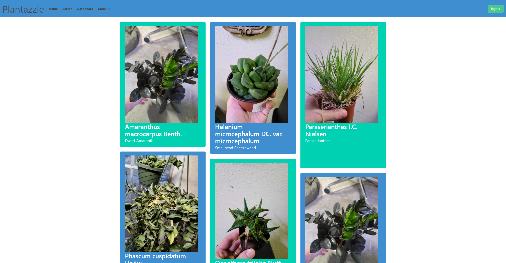
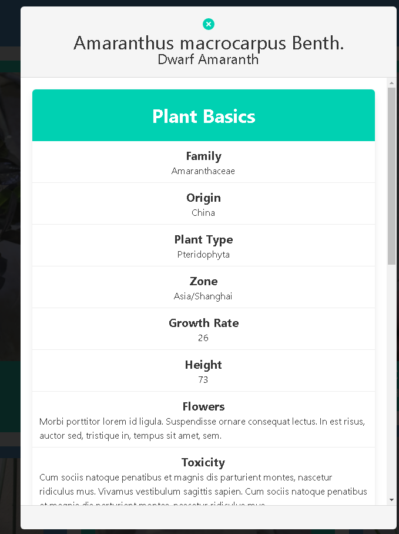
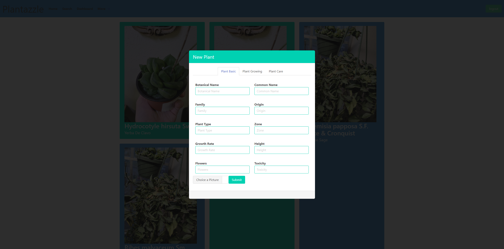
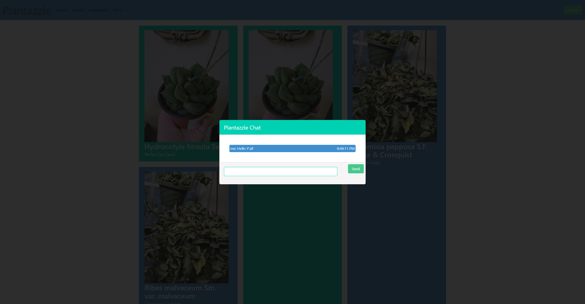

# Plantazzle
[](./LICENSE)
[](https://nodejs.org/)
[](https://lodash.com/)
[](https://bulma.io)
[](https://www.npmjs.com/package/mysql2)
[](https://sequelize.org/)
[](http://expressjs.com/)
[](https://www.npmjs.com/package/bcryptjs)
## Description

- We wanted to build a resource for gardeners and houseplant enthusiasts to find and share information about their    plants.
  Currently this information is spread across many sites and is not always consistent so we wanted to bring it together into one place that is 
  user generated. It will also be a social hub for everyone interested, by having chat to discuss problems and successes.
  We gained a bunch of knowledge about project scope and planning to use in future endeavours.

## Table of Contents

- [Installation](#installation)
- [Usage](#usage)
- [Credits](#credits)
- [License](#license)

## Installation

- You will need to have Nodejs installed along with Node Package Manager(NPM)  You can 
find some links below on how to install Node and NPM on Windows, Linux, and macOS.
### Dependancies
[](https://nodejs.org/en/download/)
* [How to Install Node.js and NPM on Windows - phoenixNAP](https://phoenixnap.com/kb/install-node-js-npm-on-windows)
* [How to install Node.js and npm on macOS - newline](https://www.newline.co/@Adele/how-to-install-nodejs-and-npm-on-macos--22782681)
* [How To Install Node.js on Ubuntu 20.04 - DigitalOcean](https://www.digitalocean.com/community/tutorials/how-to-install-node-js-on-ubuntu-20-04)
### Clone
Assuming you have Node and NPM you can clone this GitHub repo, go into the directory, 
and install the package.json file with NPM.
```bash
git clone https://github.com/AndyMcAlpin/Plantazzle
cd Plantazzle
npm install
```
### Zip
Another method is to download the zip file, unzip the contents to a specific directory 
and install the package.json file.

These commands that work on all three. (Windows, macOS, Linux) assuming they have 
curl & tar.  Which newer version of Windows have.
```bash
curl -L -o gen-me-read.zip https://github.com/AndyMcAlpin/Plantazzle/archive/refs/heads/main.zip
cd Plantazzle
npm install
```
- add a .env file with DB_NAME for your database, DB_USER for your mysql username, and DB_PW for your password.
    DB_NAME='example'
    DB_USER='example'
    DB_PW='example'

- run 
node seeds 
to initialize seed info
- run 
node server.js 
to start a server

## Usage

Provide instructions and examples for use. Include screenshots as needed.

To add a screenshot, create an `assets/images` folder in your repository and upload your screenshot to it. Then, using the relative filepath, add it to your README using the following syntax:

    ```md
    
    ```

## Usage/Examples
You use the demo [here](https://salty-dawn-76084.herokuapp.com).

### Start
```bash
node server
```

### Sign Up
You can sign up by providing very basic information.


### Login
When coming to site if you are already signed up you can log in by using your username and password.


### Plants
You can view all of the different kinds of plants



### Add Plants
You can add different kinds of plants


### Chat
You can jump into our public chat and see what is going one


## Credits

- Andy McAlpin https://github.com/AndyMcAlpin
- Jon Taylor https://github.com/DevJonTaylor
- William Jardell https://github.com/PeauxBoi

## License
[](./LICENSE)

MIT License

Copyright (c) 2022 Andy McAlpin

Permission is hereby granted, free of charge, to any person obtaining a copy
of this software and associated documentation files (the "Software"), to deal
in the Software without restriction, including without limitation the rights
to use, copy, modify, merge, publish, distribute, sublicense, and/or sell
copies of the Software, and to permit persons to whom the Software is
furnished to do so, subject to the following conditions:

The above copyright notice and this permission notice shall be included in all
copies or substantial portions of the Software.

THE SOFTWARE IS PROVIDED "AS IS", WITHOUT WARRANTY OF ANY KIND, EXPRESS OR
IMPLIED, INCLUDING BUT NOT LIMITED TO THE WARRANTIES OF MERCHANTABILITY,
FITNESS FOR A PARTICULAR PURPOSE AND NONINFRINGEMENT. IN NO EVENT SHALL THE
AUTHORS OR COPYRIGHT HOLDERS BE LIABLE FOR ANY CLAIM, DAMAGES OR OTHER
LIABILITY, WHETHER IN AN ACTION OF CONTRACT, TORT OR OTHERWISE, ARISING FROM,
OUT OF OR IN CONNECTION WITH THE SOFTWARE OR THE USE OR OTHER DEALINGS IN THE
SOFTWARE.